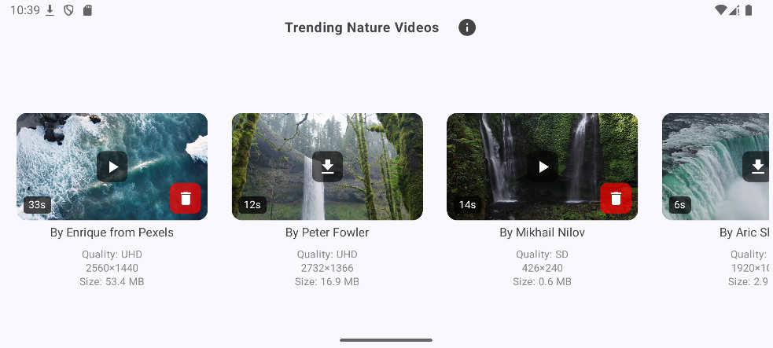
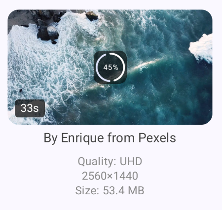
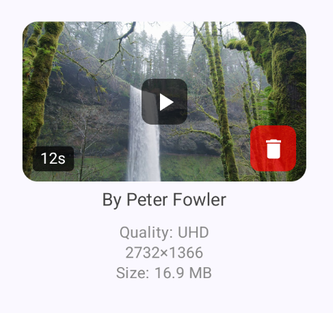
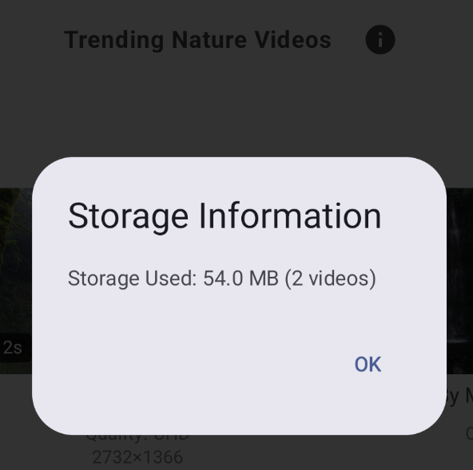
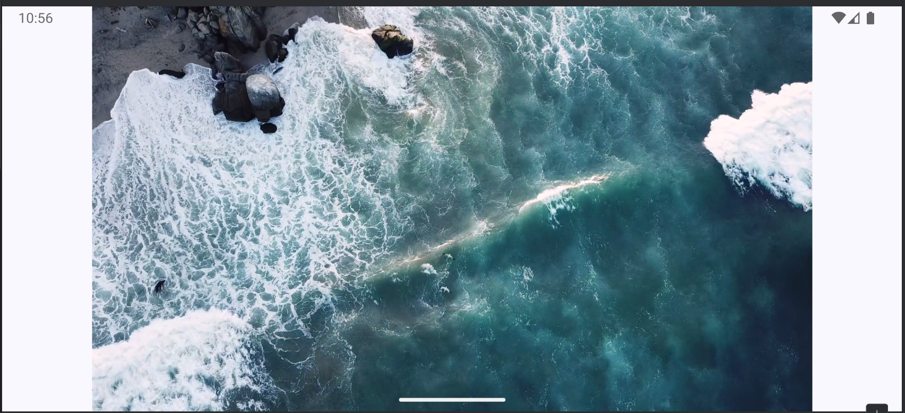

# OwlPlayer
This is a demo project developed in approximately 4 hours (3.5 hours for development with Cursor, and 0.5 hours for refinement, debugging, and documentation).

## Overview
OwlPlayer is a video player that downloads videos from Pexels. Once downloaded, videos can be played offline.
- The app is designed for landscape orientation

  
- We've selected nature videos from the Pexels platform. Tap the download button to start downloading

  

- You can see when downloads start and track download progress

  

- Once a video is downloaded, you can play or remove it to free up storage

  

- We've also provided a storage usage information dialog

  

  During video playback, use Android's native Back button to navigate back

## Installation
A debug build (app-debug.apk) is currently available in the project root for your convenience.
 >> [APK FILE](app-debug.apk)

## Development Environment
For reviewers and contributors looking to build the project:

- Android Studio Hedgehog (2023.1.1) or newer
- JDK 11
- Gradle 8.11.1
- Kotlin 1.9.21
- Minimum SDK: 26 (Android 8.0)
- Target SDK: 35 (Android 15)
- Compose UI toolkit
- Hilt for dependency injection

To build the project:
1. Clone the repository
2. Open in Android Studio
3. Sync Gradle files
4. Build using the standard Android Studio build process

## Architecture
The application follows modern Android development best practices:
- MVVM architecture with Clean Architecture principles
- Repository pattern for data operations
- Retrofit + OkHttp for network communication
- Dependency injection using Hilt
- AndroidX Media3 ExoPlayer for video playback and UI components

## API Endpoints
The application integrates with two main Pexels API endpoints:

1. **Video Search**: `https://api.pexels.com/videos/search`
   - Used for searching videos with parameters like query, per_page, and page
   - Currently we're displaying `query=Nature` and `per_page=10`
   - Returns video collections with metadata and available formats

2. **Video by ID**: `https://api.pexels.com/videos/videos/{id}`
   - Used to fetch a specific video by its unique identifier
   - Returns detailed information about a single video

# Features

## Video Discovery
- Search functionality for Pexels video library
- Video fetching by ID
- Multiple quality options (HD, Full HD, 4K)

## Offline Capabilities
- Download videos for offline viewing using OkHttp for file downloads
- Persistent storage through SharedPreferences for downloaded video metadata
- StateFlow-based download progress tracking in real-time (0-100%)
- The download is performed through OkHttp, which detects network failures
- Automatic cleanup of partial downloads on error

## Connectivity Management
- Automatic network state monitoring
- Seamless handling of connectivity changes
- Initial content loading when network becomes available

# Future Enhancements
- Implement exponential backoff recovery schema for critical network status issues
- Since the Search API is paged, we can do search box and infinite scrollable list
- Decide whether to share downloaded video content with the system's Gallery app
- Implement Room database to create structured relationships between downloaded video files and Pexels metadata
- Add a storage management interface for users to view and manage downloaded content
- Define a policy for handling videos that are no longer available in the Pexels API (display or remove local data)
- Add unit tests for business logic, which would be straightforward given our CLEAN architecture implementation
